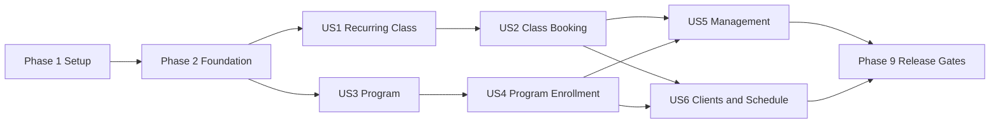

# Tasks: Fitness Class and Program Booking

**Input**: Design documents from
`/specs/001-manage-fitness-bookings/`

**Prerequisites**: `plan.md`, `spec.md`, `research.md`, `data-model.md`,
`contracts/web-routes.md`, `quickstart.md`

**Tests**: Automated tests are required for every behavior change by the project
constitution. Story test tasks must be written first and observed failing before
their implementation tasks begin.

**Organization**: Tasks are grouped by user story so each story can be
implemented and validated as an independently useful increment.

## Format

Each task uses `[ID] [P?] [Story?] Description with exact file path`.

- **[P]**: Can proceed in parallel with adjacent tasks because it changes
  different files and has no dependency on an incomplete adjacent task.
- **[US1]...[US6]**: Maps the task to the corresponding specification story.

## Phase 1: Setup

**Purpose**: Create the solution, deterministic local environment, Azure
infrastructure skeleton, and quality entry points.

- [ ] T001 Create `FitnessClassBooker.sln` and scaffold the ASP.NET Core Razor Pages application in `src/FitnessClassBooker.Web/FitnessClassBooker.Web.csproj`
- [ ] T002 Add unit, integration, contract, and end-to-end test projects to `FitnessClassBooker.sln` in `tests/FitnessClassBooker.UnitTests/FitnessClassBooker.UnitTests.csproj`, `tests/FitnessClassBooker.IntegrationTests/FitnessClassBooker.IntegrationTests.csproj`, `tests/FitnessClassBooker.ContractTests/FitnessClassBooker.ContractTests.csproj`, and `tests/FitnessClassBooker.EndToEndTests/FitnessClassBooker.EndToEndTests.csproj`
- [ ] T003 Configure pinned central NuGet versions and locked restore for ASP.NET Core, EF Core, Npgsql, Noda Time, OpenTelemetry, xUnit, Testcontainers, Playwright, and axe-core in `Directory.Packages.props` and `.config/dotnet-tools.json`
- [ ] T004 [P] Enable nullable reference types, analyzers, warnings-as-errors, deterministic builds, and repository formatting rules in `Directory.Build.props` and `.editorconfig`
- [ ] T005 [P] Define the application image and PostgreSQL 18 local stack with health checks, persistent development data, and ignored secret input in `Dockerfile`, `compose.yaml`, `.env.example`, and `.gitignore`
- [ ] T006 Implement local startup/readiness/reset orchestration in `scripts/dev-up.sh`
- [ ] T007 [P] Add executable build/test/browser/load wrappers in `scripts/test.sh`, `scripts/test-e2e.sh`, and `scripts/test-load.sh`
- [ ] T008 Create the Azure Developer CLI service definition and parameterized Bicep entry point in `azure.yaml`, `infra/main.bicep`, and `infra/main.parameters.json`
- [ ] T009 [P] Define App Service VNet integration, private DNS, and PostgreSQL 18 Flexible Server resources in `infra/modules/networking.bicep` and `infra/modules/database.bicep`
- [ ] T010 [P] Define Linux App Service, managed identity, Key Vault references, Log Analytics, and Application Insights in `infra/modules/app-service.bicep`, `infra/modules/key-vault.bicep`, and `infra/modules/monitoring.bicep`
- [ ] T011 Add locked restore, formatting, analyzer, build, and test gates to `.github/workflows/ci.yml`

**Checkpoint**: The empty application builds, the local containers become
healthy, and Azure infrastructure can be statically validated.

---

## Phase 2: Foundational

**Purpose**: Implement the shared identity, access, persistence, time, UI,
testing, and operations capabilities required by every user story.

**Critical**: No user story implementation begins until this phase passes.

### Foundational Tests

- [ ] T012 Create reusable PostgreSQL 18 Testcontainers, `WebApplicationFactory`, fake clock, authenticated client, and database reset fixtures in `tests/FitnessClassBooker.IntegrationTests/Infrastructure/AppFactory.cs`, `tests/FitnessClassBooker.IntegrationTests/Infrastructure/PostgresFixture.cs`, and `tests/FitnessClassBooker.ContractTests/Infrastructure/ContractAppFactory.cs`
- [ ] T013 [P] Write failing identity role, ownership, student-access, login, logout, and cross-user denial tests in `tests/FitnessClassBooker.IntegrationTests/Identity/IdentityAccessTests.cs` and `tests/FitnessClassBooker.ContractTests/Identity/AccountRouteTests.cs`
- [ ] T014 [P] Write failing deterministic clock, IANA validation, skipped-time, ambiguous-time, and wall-clock preservation tests in `tests/FitnessClassBooker.UnitTests/Infrastructure/Time/OfferingTimeResolverTests.cs`
- [ ] T015 [P] Write failing health, migration readiness, anti-forgery, validation-summary focus, and shared error-state contracts in `tests/FitnessClassBooker.ContractTests/Infrastructure/FoundationRouteTests.cs`

### Foundational Implementation

- [ ] T016 Implement `ApplicationUser`, Trainer/Student roles, and `TrainerStudentAccess` with invariants in `src/FitnessClassBooker.Web/Identity/ApplicationUser.cs`, `src/FitnessClassBooker.Web/Identity/ApplicationRoles.cs`, and `src/FitnessClassBooker.Web/Identity/TrainerStudentAccess.cs`
- [ ] T017 Configure Identity/access persistence, indexes, status constraints, and initial EF Core migration in `src/FitnessClassBooker.Web/Infrastructure/Data/AppDbContext.cs`, `src/FitnessClassBooker.Web/Infrastructure/Data/Configurations/IdentityConfigurations.cs`, and `src/FitnessClassBooker.Web/Infrastructure/Data/Migrations/`
- [ ] T018 Implement secure cookie settings, login/logout pages, role conventions, and resource authorization helpers in `src/FitnessClassBooker.Web/Program.cs`, `src/FitnessClassBooker.Web/Identity/AuthorizationPolicies.cs`, and `src/FitnessClassBooker.Web/Pages/Account/`
- [ ] T019 Implement Development-only trainer/student/access seed data with environment-provided passwords in `src/FitnessClassBooker.Web/Infrastructure/Data/DevelopmentDataSeeder.cs`
- [ ] T020 Implement injected clock, IANA zone validation, deterministic local-time resolution, and DST adjustment reporting in `src/FitnessClassBooker.Web/Infrastructure/Time/SystemClockAdapter.cs` and `src/FitnessClassBooker.Web/Infrastructure/Time/OfferingTimeResolver.cs`
- [ ] T021 Implement PostgreSQL advisory-locked startup migrations and readiness state in `src/FitnessClassBooker.Web/Infrastructure/Data/DatabaseMigrator.cs`
- [ ] T022 Implement the responsive Razor layout, skip link, shared navigation, design tokens, form components, status badges, validation summary, flash confirmation, and bundled Bootstrap assets in `src/FitnessClassBooker.Web/Pages/Shared/`, `src/FitnessClassBooker.Web/wwwroot/css/site.css`, and `src/FitnessClassBooker.Web/wwwroot/js/site.js`
- [ ] T023 Implement anti-forgery defaults, correlation IDs, safe exception handling, stable error keys, security headers, and role-aware home routing in `src/FitnessClassBooker.Web/Program.cs`, `src/FitnessClassBooker.Web/Infrastructure/Web/ErrorHandlingMiddleware.cs`, and `src/FitnessClassBooker.Web/Pages/Index.cshtml.cs`
- [ ] T024 Configure structured logs, OpenTelemetry, optional Azure Monitor export, liveness/readiness endpoints, and base operational metrics in `src/FitnessClassBooker.Web/Infrastructure/Observability/ObservabilityExtensions.cs`, `src/FitnessClassBooker.Web/Infrastructure/Observability/BookingMetrics.cs`, and `src/FitnessClassBooker.Web/Program.cs`

**Checkpoint**: Authenticated role/access boundaries, deterministic time behavior,
database startup, health endpoints, and the shared accessible shell work against
local PostgreSQL.

---

## Phase 3: User Story 1 - Publish a Recurring Class (Priority: P1)

**Goal**: A trainer can draft, preview, publish, and view an indefinite or
date-bounded weekly class with per-occurrence capacity.

**Independent Test**: Publish Tuesday Zumba from 6:00 PM to 7:00 PM with capacity
12 and no end date; verify 12 weeks of future Tuesday occurrences while the
draft remains hidden before publication.

### Tests for User Story 1

- [ ] T025 [P] [US1] Write failing recurring-series validation, schedule overlap, first-weekday, sequence, DST, and lifecycle unit tests in `tests/FitnessClassBooker.UnitTests/Features/Classes/RecurringClassSeriesTests.cs` and `tests/FitnessClassBooker.UnitTests/Features/Classes/RecurringOccurrenceGeneratorTests.cs`
- [ ] T026 [P] [US1] Write failing EF mapping, constraint, parent-lock overlap, idempotent materialization, and 12-week horizon integration tests in `tests/FitnessClassBooker.IntegrationTests/Features/Classes/RecurringClassPersistenceTests.cs`
- [ ] T027 [P] [US1] Write failing trainer class list/create/detail/preview/publish route, authorization, validation, and anti-forgery tests in `tests/FitnessClassBooker.ContractTests/Features/Classes/TrainerClassRouteTests.cs`
- [ ] T028 [P] [US1] Write the failing keyboard/responsive/axe-core trainer draft-preview-publish browser journey in `tests/FitnessClassBooker.EndToEndTests/Features/Classes/PublishRecurringClassTests.cs`

### Implementation for User Story 1

- [ ] T029 [US1] Implement `RecurringClassSeries`, `RecurringClassSchedule`, and `ClassOccurrence` aggregates, statuses, and transitions in `src/FitnessClassBooker.Web/Features/Classes/Domain/RecurringClassSeries.cs`, `src/FitnessClassBooker.Web/Features/Classes/Domain/RecurringClassSchedule.cs`, and `src/FitnessClassBooker.Web/Features/Classes/Domain/ClassOccurrence.cs`
- [ ] T030 [US1] Configure recurring class tables, constraints, partial indexes, `xmin` concurrency, and migration in `src/FitnessClassBooker.Web/Features/Classes/Infrastructure/RecurringClassConfigurations.cs` and `src/FitnessClassBooker.Web/Infrastructure/Data/Migrations/`
- [ ] T031 [US1] Implement parent-locked schedule validation and deterministic occurrence preview/generation in `src/FitnessClassBooker.Web/Features/Classes/Application/RecurringClassScheduleService.cs` and `src/FitnessClassBooker.Web/Features/Classes/Application/RecurringOccurrenceGenerator.cs`
- [ ] T032 [US1] Implement draft creation and transactional publication with rolling-horizon materialization in `src/FitnessClassBooker.Web/Features/Classes/Application/CreateRecurringClass.cs` and `src/FitnessClassBooker.Web/Features/Classes/Application/PublishRecurringClass.cs`
- [ ] T033 [US1] Implement idempotent startup/daily horizon extension and completion maintenance in `src/FitnessClassBooker.Web/Features/Classes/Infrastructure/RecurringClassMaintenanceService.cs`
- [ ] T034 [US1] Implement trainer class list, create, preview, publish, and detail PageModels in `src/FitnessClassBooker.Web/Features/Classes/Pages/Trainer/Index.cshtml.cs`, `src/FitnessClassBooker.Web/Features/Classes/Pages/Trainer/Create.cshtml.cs`, and `src/FitnessClassBooker.Web/Features/Classes/Pages/Trainer/Details.cshtml.cs`
- [ ] T035 [US1] Implement loading, empty, draft, validation, preview, publication-success, cancelled, and failure UI states in `src/FitnessClassBooker.Web/Features/Classes/Pages/Trainer/Index.cshtml`, `src/FitnessClassBooker.Web/Features/Classes/Pages/Trainer/Create.cshtml`, and `src/FitnessClassBooker.Web/Features/Classes/Pages/Trainer/Details.cshtml`
- [ ] T036 [US1] Add class publication/materialization metrics, structured logs, and indexed occurrence query verification in `src/FitnessClassBooker.Web/Features/Classes/Infrastructure/ClassTelemetry.cs` and `tests/FitnessClassBooker.IntegrationTests/Features/Classes/RecurringClassQueryPlanTests.cs`

**Checkpoint**: User Story 1 is independently demonstrable and accessible.

---

## Phase 4: User Story 2 - Book the Next Class (Priority: P1)

**Goal**: A student sees the earliest available occurrence, books only that
occurrence, and appears in their schedule and the trainer roster without
overbooking.

**Independent Test**: Book the suggested Zumba occurrence and verify exactly one
student schedule item and one roster entry; two students racing for one remaining
place produce exactly one new booking.

### Tests for User Story 2

- [ ] T037 [P] [US2] Write failing next-occurrence selection, result classification, duplicate-first, and booking state unit tests in `tests/FitnessClassBooker.UnitTests/Features/Classes/NextOccurrenceSelectorTests.cs` and `tests/FitnessClassBooker.UnitTests/Features/Classes/ClassBookingResultTests.cs`
- [ ] T038 [P] [US2] Write failing atomic capacity, duplicate retry at full capacity, final-place race, booking-versus-cancellation, access, and rollback integration tests in `tests/FitnessClassBooker.IntegrationTests/Features/Classes/ClassBookingConcurrencyTests.cs`
- [ ] T039 [P] [US2] Write failing student class catalog/detail/book, schedule, and trainer roster route contracts in `tests/FitnessClassBooker.ContractTests/Features/Classes/StudentClassRouteTests.cs` and `tests/FitnessClassBooker.ContractTests/Features/Classes/ClassRosterRouteTests.cs`
- [ ] T040 [P] [US2] Write the failing student discovery-booking-schedule and trainer-roster Playwright journey with axe-core checks in `tests/FitnessClassBooker.EndToEndTests/Features/Classes/BookNextClassTests.cs`
- [ ] T041 [P] [US2] Define the failing last-place race and class browsing performance scenarios in `tests/performance/booking.js` and `tests/performance/browsing.js`

### Implementation for User Story 2

- [ ] T042 [US2] Implement access-scoped class catalog and earliest-available occurrence queries in `src/FitnessClassBooker.Web/Features/Classes/Application/ClassCatalogQuery.cs` and `src/FitnessClassBooker.Web/Features/Classes/Application/NextOccurrenceSelector.cs`
- [ ] T043 [US2] Implement `ClassBooking` persistence and duplicate-first atomic reserve/cancel-safe capacity command in `src/FitnessClassBooker.Web/Features/Classes/Domain/ClassBooking.cs`, `src/FitnessClassBooker.Web/Features/Classes/Infrastructure/ClassBookingConfiguration.cs`, and `src/FitnessClassBooker.Web/Features/Classes/Application/BookClassOccurrence.cs`
- [ ] T044 [US2] Implement student class list/detail/book handlers and full/cancelled/started/conflict classification in `src/FitnessClassBooker.Web/Features/Classes/Pages/Student/Index.cshtml.cs` and `src/FitnessClassBooker.Web/Features/Classes/Pages/Student/Details.cshtml.cs`
- [ ] T045 [US2] Implement student class loading, empty, next-available, one-occurrence confirmation, full, cancelled, started, and failure views in `src/FitnessClassBooker.Web/Features/Classes/Pages/Student/Index.cshtml` and `src/FitnessClassBooker.Web/Features/Classes/Pages/Student/Details.cshtml`
- [ ] T046 [US2] Implement the class-booking portion of the student schedule projection in `src/FitnessClassBooker.Web/Features/Schedule/Application/StudentScheduleQuery.cs`
- [ ] T047 [US2] Implement class booking list/detail pages and success focus handling in `src/FitnessClassBooker.Web/Features/Schedule/Pages/Index.cshtml`, `src/FitnessClassBooker.Web/Features/Schedule/Pages/Index.cshtml.cs`, `src/FitnessClassBooker.Web/Features/Schedule/Pages/BookingDetails.cshtml`, and `src/FitnessClassBooker.Web/Features/Schedule/Pages/BookingDetails.cshtml.cs`
- [ ] T048 [US2] Implement owner-scoped occurrence roster query with capacity/status history in `src/FitnessClassBooker.Web/Features/Classes/Application/ClassRosterQuery.cs`
- [ ] T049 [US2] Implement the trainer occurrence roster PageModel/view and booking metrics in `src/FitnessClassBooker.Web/Features/Classes/Pages/Trainer/Occurrence.cshtml`, `src/FitnessClassBooker.Web/Features/Classes/Pages/Trainer/Occurrence.cshtml.cs`, and `src/FitnessClassBooker.Web/Features/Classes/Infrastructure/ClassTelemetry.cs`

**Checkpoint**: The P1 MVP is complete: trainers publish recurring classes and
students safely book one occurrence.

---

## Phase 5: User Story 3 - Publish a Fixed-Duration Program (Priority: P2)

**Goal**: A trainer previews and publishes a finite multi-week program with
multiple weekly schedules and one shared participant limit.

**Independent Test**: Publish a four-week program with Monday, Wednesday, and
Friday schedules and verify exactly 12 ordered persisted sessions.

### Tests for User Story 3

- [ ] T050 [P] [US3] Write failing program validation, seven-day week calculation, schedule overlap, DST, preview, and lifecycle unit tests in `tests/FitnessClassBooker.UnitTests/Features/Programs/ProgramTests.cs` and `tests/FitnessClassBooker.UnitTests/Features/Programs/ProgramSessionGeneratorTests.cs`
- [ ] T051 [P] [US3] Write failing program mapping, constraints, parent-lock overlap, atomic session persistence, and publication integration tests in `tests/FitnessClassBooker.IntegrationTests/Features/Programs/ProgramPersistenceTests.cs`
- [ ] T052 [P] [US3] Write failing trainer program list/create/preview/detail/publish route, authorization, validation, and anti-forgery tests in `tests/FitnessClassBooker.ContractTests/Features/Programs/TrainerProgramRouteTests.cs`
- [ ] T053 [P] [US3] Write the failing keyboard/responsive/axe-core four-week program preview-publication journey in `tests/FitnessClassBooker.EndToEndTests/Features/Programs/PublishProgramTests.cs`

### Implementation for User Story 3

- [ ] T054 [US3] Implement `Program`, `ProgramSchedule`, and `ProgramSession` aggregates, statuses, and transitions in `src/FitnessClassBooker.Web/Features/Programs/Domain/Program.cs`, `src/FitnessClassBooker.Web/Features/Programs/Domain/ProgramSchedule.cs`, and `src/FitnessClassBooker.Web/Features/Programs/Domain/ProgramSession.cs`
- [ ] T055 [US3] Configure program/session tables, constraints, indexes, `xmin` concurrency, and migration in `src/FitnessClassBooker.Web/Features/Programs/Infrastructure/ProgramConfigurations.cs` and `src/FitnessClassBooker.Web/Infrastructure/Data/Migrations/`
- [ ] T056 [US3] Implement parent-locked schedule validation and deterministic finite session preview in `src/FitnessClassBooker.Web/Features/Programs/Application/ProgramScheduleService.cs` and `src/FitnessClassBooker.Web/Features/Programs/Application/ProgramSessionGenerator.cs`
- [ ] T057 [US3] Implement draft creation and transactional program/session publication in `src/FitnessClassBooker.Web/Features/Programs/Application/CreateProgram.cs` and `src/FitnessClassBooker.Web/Features/Programs/Application/PublishProgram.cs`
- [ ] T058 [US3] Implement trainer program list, create, preview, publish, and detail PageModels in `src/FitnessClassBooker.Web/Features/Programs/Pages/Trainer/Index.cshtml.cs`, `src/FitnessClassBooker.Web/Features/Programs/Pages/Trainer/Create.cshtml.cs`, and `src/FitnessClassBooker.Web/Features/Programs/Pages/Trainer/Details.cshtml.cs`
- [ ] T059 [US3] Implement loading, empty, draft, validation, complete-session preview, publication-success, cancelled, and failure views in `src/FitnessClassBooker.Web/Features/Programs/Pages/Trainer/Index.cshtml`, `src/FitnessClassBooker.Web/Features/Programs/Pages/Trainer/Create.cshtml`, and `src/FitnessClassBooker.Web/Features/Programs/Pages/Trainer/Details.cshtml`
- [ ] T060 [US3] Extend maintenance to complete elapsed sessions/programs deterministically in `src/FitnessClassBooker.Web/Features/Programs/Infrastructure/ProgramMaintenanceService.cs`
- [ ] T061 [US3] Add program publication/session metrics, structured logs, and indexed session query verification in `src/FitnessClassBooker.Web/Features/Programs/Infrastructure/ProgramTelemetry.cs` and `tests/FitnessClassBooker.IntegrationTests/Features/Programs/ProgramQueryPlanTests.cs`

**Checkpoint**: User Story 3 is independently demonstrable and accessible.

---

## Phase 6: User Story 4 - Enroll in the Next Program (Priority: P2)

**Goal**: A student enrolls once in a complete future program, consuming one
shared place and receiving every session.

**Independent Test**: Enroll in the four-week program and verify one roster row,
all 12 student schedule items, duplicate idempotency, and one winner for the last
place.

### Tests for User Story 4

- [ ] T062 [P] [US4] Write failing whole-program enrollment, duplicate-first, earliest-session deadline, and result classification unit tests in `tests/FitnessClassBooker.UnitTests/Features/Programs/ProgramEnrollmentResultTests.cs`
- [ ] T063 [P] [US4] Write failing atomic capacity, duplicate retry at full capacity, final-place race, enrollment-versus-withdrawal, started-program, access, and rollback integration tests in `tests/FitnessClassBooker.IntegrationTests/Features/Programs/ProgramEnrollmentConcurrencyTests.cs`
- [ ] T064 [P] [US4] Write failing student program catalog/detail/enroll, unified schedule, and program roster route contracts in `tests/FitnessClassBooker.ContractTests/Features/Programs/StudentProgramRouteTests.cs` and `tests/FitnessClassBooker.ContractTests/Features/Programs/ProgramRosterRouteTests.cs`
- [ ] T065 [P] [US4] Write the failing full-program enrollment-schedule-roster Playwright journey with axe-core checks in `tests/FitnessClassBooker.EndToEndTests/Features/Programs/EnrollInProgramTests.cs`
- [ ] T066 [P] [US4] Add the failing whole-program final-place and schedule-browsing k6 scenarios in `tests/performance/enrollment.js` and `tests/performance/program-browsing.js`

### Implementation for User Story 4

- [ ] T067 [US4] Implement access-scoped upcoming program catalog and detail queries in `src/FitnessClassBooker.Web/Features/Programs/Application/ProgramCatalogQuery.cs`
- [ ] T068 [US4] Implement `ProgramEnrollment` persistence and duplicate-first atomic enrollment with authoritative earliest-session deadline in `src/FitnessClassBooker.Web/Features/Programs/Domain/ProgramEnrollment.cs`, `src/FitnessClassBooker.Web/Features/Programs/Infrastructure/ProgramEnrollmentConfiguration.cs`, and `src/FitnessClassBooker.Web/Features/Programs/Application/EnrollInProgram.cs`
- [ ] T069 [US4] Implement student program list/detail/enroll handlers and full/cancelled/started/conflict classification in `src/FitnessClassBooker.Web/Features/Programs/Pages/Student/Index.cshtml.cs` and `src/FitnessClassBooker.Web/Features/Programs/Pages/Student/Details.cshtml.cs`
- [ ] T070 [US4] Implement complete-session confirmation and loading, empty, available, full, cancelled, started, and failure views in `src/FitnessClassBooker.Web/Features/Programs/Pages/Student/Index.cshtml` and `src/FitnessClassBooker.Web/Features/Programs/Pages/Student/Details.cshtml`
- [ ] T071 [US4] Extend the student schedule projection/index and implement enrollment detail with all remaining sessions from confirmed enrollments in `src/FitnessClassBooker.Web/Features/Schedule/Application/StudentScheduleQuery.cs`, `src/FitnessClassBooker.Web/Features/Schedule/Pages/Index.cshtml`, `src/FitnessClassBooker.Web/Features/Schedule/Pages/EnrollmentDetails.cshtml`, and `src/FitnessClassBooker.Web/Features/Schedule/Pages/EnrollmentDetails.cshtml.cs`
- [ ] T072 [US4] Implement owner-scoped program roster query with capacity and enrollment status history in `src/FitnessClassBooker.Web/Features/Programs/Application/ProgramRosterQuery.cs`
- [ ] T073 [US4] Implement the trainer program roster view/PageModel in `src/FitnessClassBooker.Web/Features/Programs/Pages/Trainer/Roster.cshtml` and `src/FitnessClassBooker.Web/Features/Programs/Pages/Trainer/Roster.cshtml.cs`
- [ ] T074 [US4] Add enrollment conflict/deadline metrics, structured logs, and program schedule query verification in `src/FitnessClassBooker.Web/Features/Programs/Infrastructure/ProgramTelemetry.cs`

**Checkpoint**: User Stories 3 and 4 form an independently usable program
publishing/enrollment increment.

---

## Phase 7: User Story 5 - Manage Offerings and Participants (Priority: P2)

**Goal**: A trainer reviews rosters, previews future impact, edits or closes
offerings, cancels occurrences/programs, and removes participants while retaining
history.

**Independent Test**: Preview and apply a future schedule change, reject a stale
impact token, cancel one occurrence, and remove one class/program participant
without changing past or unrelated records.

### Tests for User Story 5

- [ ] T075 [P] [US5] Write failing class/program edit-impact, effective-date, capacity-floor, schedule-remapping, and affected-participant unit tests in `tests/FitnessClassBooker.UnitTests/Features/Management/EditImpactCalculatorTests.cs`
- [ ] T076 [P] [US5] Write failing actor/aggregate/proposal/digest binding, tampering, route-purpose separation, and 15-minute expiry tests in `tests/FitnessClassBooker.UnitTests/Features/Management/ImpactTokenProtectorTests.cs`
- [ ] T077 [P] [US5] Write failing serialized class/program schedule-edit, stale concurrency, re-materialization, and impact-digest integration tests in `tests/FitnessClassBooker.IntegrationTests/Features/Management/OfferingEditTests.cs`
- [ ] T078 [P] [US5] Write failing booking-state, enrollment-state, cancellation, participant removal, capacity release, lock-order, and history integration tests in `tests/FitnessClassBooker.IntegrationTests/Features/Management/OfferingLifecycleTests.cs`
- [ ] T079 [P] [US5] Write failing trainer edit-impact/apply/close/cancel/remove route, authorization, anti-forgery, and conflict contracts in `tests/FitnessClassBooker.ContractTests/Features/Management/ManagementRouteTests.cs`
- [ ] T080 [P] [US5] Write the failing reviewed-edit, stale-token, occurrence-cancel, and participant-removal Playwright journeys with axe-core checks in `tests/FitnessClassBooker.EndToEndTests/Features/Management/ManageOfferingsTests.cs`

### Implementation for User Story 5

- [ ] T081 [US5] Implement the route-specific 15-minute Data Protection impact-token service in `src/FitnessClassBooker.Web/Features/Management/Application/ImpactTokenProtector.cs`
- [ ] T082 [US5] Implement class edit-impact calculation, token issuance/validation, digest recheck, capacity-floor enforcement, and transactional apply in `src/FitnessClassBooker.Web/Features/Classes/Application/EditRecurringClass.cs`
- [ ] T083 [US5] Implement class edit-impact/apply forms with effective date, affected occurrence/student summary, concurrency handling, and recovery states in `src/FitnessClassBooker.Web/Features/Classes/Pages/Trainer/Edit.cshtml` and `src/FitnessClassBooker.Web/Features/Classes/Pages/Trainer/Edit.cshtml.cs`
- [ ] T084 [US5] Implement recurring series booking open/close, close, and whole-series cancellation transitions in `src/FitnessClassBooker.Web/Features/Classes/Application/ChangeRecurringClassState.cs`
- [ ] T085 [US5] Implement single future occurrence cancellation with retained bookings and capacity state in `src/FitnessClassBooker.Web/Features/Classes/Application/CancelClassOccurrence.cs` and `src/FitnessClassBooker.Web/Features/Classes/Pages/Trainer/Occurrence.cshtml.cs`
- [ ] T086 [US5] Implement occurrence-first lock ordering and trainer removal of a confirmed class booking in `src/FitnessClassBooker.Web/Features/Classes/Application/RemoveClassParticipant.cs`
- [ ] T087 [US5] Implement pre-start program edit-impact calculation, token/digest validation, capacity-floor enforcement, session regeneration, and transactional apply in `src/FitnessClassBooker.Web/Features/Programs/Application/EditProgram.cs`
- [ ] T088 [US5] Implement program edit-impact/apply forms with affected session/student summary, concurrency handling, and recovery states in `src/FitnessClassBooker.Web/Features/Programs/Pages/Trainer/Edit.cshtml` and `src/FitnessClassBooker.Web/Features/Programs/Pages/Trainer/Edit.cshtml.cs`
- [ ] T089 [US5] Implement program enrollment open/close and whole-program cancellation transitions with retained sessions/enrollments in `src/FitnessClassBooker.Web/Features/Programs/Application/ChangeProgramState.cs`
- [ ] T090 [US5] Implement program-first lock ordering and trainer removal of a confirmed enrollment in `src/FitnessClassBooker.Web/Features/Programs/Application/RemoveProgramParticipant.cs`
- [ ] T091 [US5] Complete the trainer dashboard and offering list handlers/views for draft, active, closed, completed, and cancelled filters with capacity alerts in `src/FitnessClassBooker.Web/Pages/Trainer/Index.cshtml`, `src/FitnessClassBooker.Web/Pages/Trainer/Index.cshtml.cs`, `src/FitnessClassBooker.Web/Features/Classes/Pages/Trainer/Index.cshtml`, `src/FitnessClassBooker.Web/Features/Classes/Pages/Trainer/Index.cshtml.cs`, `src/FitnessClassBooker.Web/Features/Programs/Pages/Trainer/Index.cshtml`, and `src/FitnessClassBooker.Web/Features/Programs/Pages/Trainer/Index.cshtml.cs`

**Checkpoint**: Trainers can safely manage future offerings and participant
status without erasing history.

---

## Phase 8: User Story 6 - Review Clients and Personal Schedule (Priority: P3)

**Goal**: Trainers review their participating clients while students review
history and cancel/withdraw their own future participation.

**Independent Test**: Find a participating client, prove trainer/student data
isolation, cancel a future class, withdraw from a pre-start program, and verify
released capacity and retained statuses.

### Tests for User Story 6

- [ ] T092 [P] [US6] Write failing trainer-client summary, unified schedule ordering, upcoming/past partition, and status projection unit tests in `tests/FitnessClassBooker.UnitTests/Features/Clients/ClientProjectionTests.cs` and `tests/FitnessClassBooker.UnitTests/Features/Schedule/StudentScheduleProjectionTests.cs`
- [ ] T093 [P] [US6] Write failing client search/pagination, trainer isolation, student schedule isolation, and history integration tests in `tests/FitnessClassBooker.IntegrationTests/Features/Clients/ClientHistoryTests.cs`
- [ ] T094 [P] [US6] Write failing student cancellation/withdrawal deadline, occurrence/program-first lock order, concurrent reserve-release, counter, and audit integration tests plus the p95 k6 scenario in `tests/FitnessClassBooker.IntegrationTests/Features/Schedule/SelfServiceCancellationTests.cs` and `tests/performance/cancellation.js`
- [ ] T095 [P] [US6] Write failing client list/detail and personal schedule booking/enrollment cancel/withdraw route contracts in `tests/FitnessClassBooker.ContractTests/Features/Clients/ClientAndScheduleRouteTests.cs`
- [ ] T096 [P] [US6] Write the failing client-history and student self-service Playwright journeys with keyboard, responsive, and axe-core checks in `tests/FitnessClassBooker.EndToEndTests/Features/Clients/ClientAndScheduleTests.cs`

### Implementation for User Story 6

- [ ] T097 [US6] Implement owner-scoped client summary/search/history projections across bookings and enrollments in `src/FitnessClassBooker.Web/Features/Clients/Application/TrainerClientQuery.cs`
- [ ] T098 [US6] Implement paginated trainer client list/detail pages with empty, upcoming, past, cancelled, removed, and completed states in `src/FitnessClassBooker.Web/Features/Clients/Pages/Index.cshtml`, `src/FitnessClassBooker.Web/Features/Clients/Pages/Index.cshtml.cs`, `src/FitnessClassBooker.Web/Features/Clients/Pages/Details.cshtml`, and `src/FitnessClassBooker.Web/Features/Clients/Pages/Details.cshtml.cs`
- [ ] T099 [US6] Complete the student-owned unified schedule query with cursor pagination and no cross-student leakage in `src/FitnessClassBooker.Web/Features/Schedule/Application/StudentScheduleQuery.cs`
- [ ] T100 [US6] Complete upcoming/past personal schedule, booking detail, and enrollment/session detail views in `src/FitnessClassBooker.Web/Features/Schedule/Pages/Index.cshtml`, `src/FitnessClassBooker.Web/Features/Schedule/Pages/BookingDetails.cshtml`, and `src/FitnessClassBooker.Web/Features/Schedule/Pages/EnrollmentDetails.cshtml`
- [ ] T101 [US6] Implement occurrence-first student cancellation with start deadline, capacity release, idempotency, and retained audit status in `src/FitnessClassBooker.Web/Features/Schedule/Application/CancelOwnClassBooking.cs` and `src/FitnessClassBooker.Web/Features/Schedule/Pages/BookingDetails.cshtml.cs`
- [ ] T102 [US6] Implement program-first whole-enrollment withdrawal with earliest-session deadline, capacity release, idempotency, and retained status in `src/FitnessClassBooker.Web/Features/Schedule/Application/WithdrawFromProgram.cs` and `src/FitnessClassBooker.Web/Features/Schedule/Pages/EnrollmentDetails.cshtml.cs`
- [ ] T103 [US6] Implement deterministic completion propagation for bookings/enrollments and historical status display in `src/FitnessClassBooker.Web/Infrastructure/Data/ParticipationCompletionService.cs`
- [ ] T104 [US6] Add client/schedule/cancellation telemetry plus consistent loading, empty, confirmation, deadline, and failure state components in `src/FitnessClassBooker.Web/Features/Clients/Infrastructure/ClientTelemetry.cs`, `src/FitnessClassBooker.Web/Features/Schedule/Infrastructure/ScheduleTelemetry.cs`, and `src/FitnessClassBooker.Web/Pages/Shared/`

**Checkpoint**: All six user stories are independently functional.

---

## Phase 9: Polish and Cross-Cutting Release Gates

**Purpose**: Validate the whole product against constitutional performance,
accessibility, security, local parity, and Azure operations requirements.

- [ ] T105 [P] Run and close all cross-journey keyboard, 320px/desktop responsive, focus, semantic, contrast, and axe-core findings in `tests/FitnessClassBooker.EndToEndTests/Accessibility/AccessibilityRegressionTests.cs` and `src/FitnessClassBooker.Web/wwwroot/css/site.css`
- [ ] T106 Seed the complete 100-offering/1,000-client/10,000-session reference dataset and enforce p75/p95/zero-overbooking k6 thresholds in `tests/performance/seed-reference-data.sql`, `tests/performance/booking.js`, `tests/performance/enrollment.js`, `tests/performance/browsing.js`, `tests/performance/program-browsing.js`, `tests/performance/cancellation.js`, and `scripts/test-load.sh`
- [ ] T107 Tune and lock query indexes from measured `EXPLAIN (ANALYZE, BUFFERS)` results for catalogs, schedules, rosters, clients, and maintenance in `src/FitnessClassBooker.Web/Infrastructure/Data/Migrations/` and `tests/FitnessClassBooker.IntegrationTests/Performance/ReferenceQueryPlanTests.cs`
- [ ] T108 [P] Harden cookie, lockout, request-size, form rate-limit, HTTPS, CSP, secret-redaction, and authorization defaults in `src/FitnessClassBooker.Web/Program.cs`, `src/FitnessClassBooker.Web/Infrastructure/Web/SecurityExtensions.cs`, and `tests/FitnessClassBooker.IntegrationTests/Security/SecurityRegressionTests.cs`
- [ ] T109 Validate Bicep and deploy non-production App Service/PostgreSQL resources with migration/readiness and smoke gates in `.github/workflows/deploy.yml`, `infra/main.bicep`, and `tests/FitnessClassBooker.EndToEndTests/Smoke/AzureSmokeTests.cs`
- [ ] T110 Configure booking/enrollment conflict, p95 latency, readiness, database saturation, and occurrence-horizon dashboards/alerts in `infra/modules/monitoring.bicep`
- [ ] T111 Rehearse point-in-time restore and document health, secret rotation, migration failure, alert, and rollback procedures in `docs/operations.md`
- [ ] T112 Execute every local and Azure validation step and correct command drift in `specs/001-manage-fitness-bookings/quickstart.md`
- [ ] T113 [P] Document architecture, local startup, seeded access model, test commands, Azure deployment, and v1 exclusions in `README.md`
- [ ] T114 Run locked dependency, vulnerability, license, generated-file, and secret checks and encode them in `.github/workflows/ci.yml`
- [ ] T115 Run the complete quality suite and record FR/UX/PR/SC evidence in `specs/001-manage-fitness-bookings/checklists/release.md`

**Checkpoint**: The local and Azure-ready initial version meets all functional,
UX, performance, security, and operational gates.

---

## Dependencies and Execution Order

### Phase Dependencies

- **Phase 1** has no prerequisites.
- **Phase 2** depends on Phase 1 and blocks all stories.
- **US1** and **US3** can proceed in parallel after the foundation.
- **US2** depends on US1's materialized class occurrences.
- **US4** depends on US3's materialized program sessions.
- **US5** depends on US2 and US4 because it manages both participation types.
- **US6** depends on US2 and US4; it can proceed in parallel with US5.
- **Phase 9** follows all selected stories.

### Within Each User Story

1. Write all listed story tests and observe the expected failures.
2. Implement domain entities and persistence.
3. Implement application commands/queries.
4. Implement route handlers and views.
5. Run the story's unit, integration, contract, browser, accessibility, and
   performance checks.
6. Do not begin dependent stories until the checkpoint passes.

## Parallel Opportunities

| Scope | Tasks that can proceed together |
|-------|---------------------------------|
| Setup | T004, T005; T009, T010 |
| Foundation tests | T013, T014, T015 after T012 |
| US1 tests | T025, T026, T027, T028 |
| US2 tests | T037, T038, T039, T040, T041 |
| US3 tests | T050, T051, T052, T053 |
| US4 tests | T062, T063, T064, T065, T066 |
| US5 tests | T075, T076, T077, T078, T079, T080 |
| US6 tests | T092, T093, T094, T095, T096 |
| Story tracks | US1/US2 class track and US3/US4 program track after Phase 2 |
| Post-booking tracks | US5 and US6 after US2 and US4 |
| Release | T105, T108, T113 after all stories |

## Implementation Strategy

### MVP First

The useful MVP is both P1 stories, not US1 alone:

1. Complete Phases 1 and 2.
2. Complete US1 so trainers can publish recurring classes.
3. Complete US2 so students can safely book one occurrence.
4. Validate the class publishing/booking journey locally before adding programs.

### Incremental Delivery

1. **P1 MVP**: US1 + US2.
2. **Program increment**: US3 + US4.
3. **Trainer operations**: US5.
4. **Client/self-service increment**: US6.
5. **Production readiness**: Phase 9.

Each increment must preserve earlier acceptance scenarios and retain historical
participation state.

## Notes

- Keep all capacity-changing transactions in capacity-owner-first lock order.
- The database, not displayed availability, is authoritative for reservation
  deadlines and capacity.
- Do not add payments, waitlists, attendance, messaging, memberships, or a
  public marketplace in these tasks.
- Do not replace PostgreSQL with SQLite or an in-memory provider in integration
  tests.
- Add no cache, broker, SPA, or microservice unless a measured requirement and
  constitutional exception are approved.
